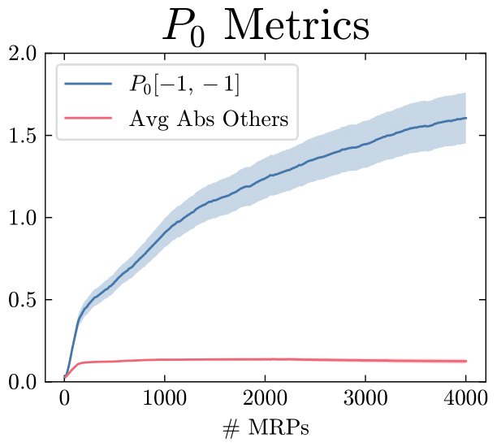
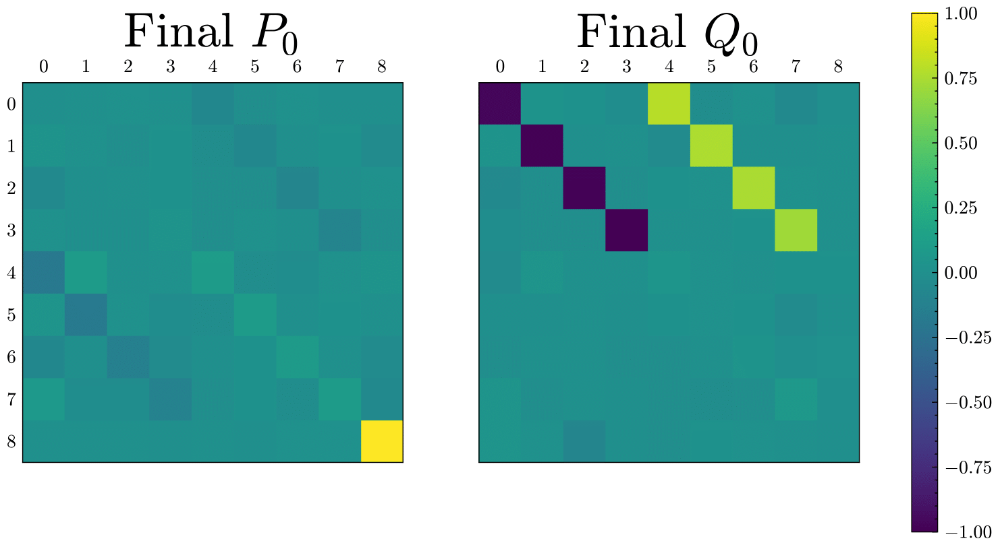
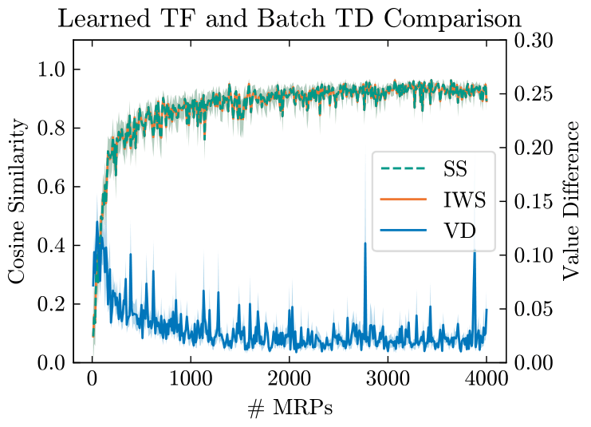

# InContextTD

Welcome to the InContextTD repository, which accompanies the paper: [Transformers Learn Temporal Difference Methods for In-Context Reinforcement Learning](https://arxiv.org/abs/2405.13861).

## Table of Contents
- [Introduction](#introduction)
- [Installation](#installation)
- [Usage](#usage)
  - [Quick Start](#quick-start)
  - [Custom Experiments](#custom-experiment-settings)
  - [Complete Replication](#complete-replication)
- [License](#license)

## Introduction
This repository provides the code to empirically demonstrate how transformers can learn to implement temporal difference (TD) methods for in-context policy evaluation. The experiments explore transformers' ability to apply TD learning during inference without requiring parameter updates.

## Installation
To install the required dependencies, first clone this repository, then run the following command:
```bash
python setup.py
```

## Usage

### Quick Start
To quickly replicate the experiments from Figure 2 of the paper, execute the following command:
```bash
python main.py --suffix=linear_standard --activation=identity --mode=auto -v
```

The generated figures will be saved in:
- `./logs/YYYY-MM-DD-HH-MM-SS/linear_standard/averaged_figures/` (aggregated results across all seeds)
- `./logs/YYYY-MM-DD-HH-MM-SS/linear_standard/seed_SEED/figures/` (diagnostic figures for each individual seed)

If you'd like the figures to display in the README directly, you can use the following markdown syntax to embed the images:

This will generate the following plots:






This way, the images will be displayed directly in the README, assuming the paths to the image files are correct and the images are present in the `figs` directory.

### Custom Experiment Settings
To run experiments with custom configurations, use:
```bash
python main.py [options]
```
Below is a list of the command-line arguments available for `main.py`:

- `-d`, `--dim_feature`: Feature dimension (default: 4)
- `-s`, `--num_states`: Number of states (default: 10)
- `-n`, `--context_length`: Context length (default: 30)
- `-l`, `--num_layers`: Number of transformer layers (default: 3)
- `--gamma`: Discount factor (default: 0.9)
- `--activation`: Activation function (choices: ['identity', 'softmax', 'relu'])
- `--sample_weight`: Flag to randomly sample a true weight vector that allows the value function to be fully represented by the features
- `--n_mrps`: Number of MRPs used for training (default: 4000)
- `--batch_size`: Mini-batch size (default: 64)
- `--n_batch_per_mrp`: Number of mini-batches sampled per MRP (default: 5)
- `--lr`: Learning rate (default: 0.001)
- `--weight_decay`: Regularization term (default: 1e-6)
- `--log_interval`: Frequency of logging during training (default: 10)
- `--mode`: Training mode (choices: ['auto', 'sequential'], default: 'auto')
- `--seed`: Random seeds (default: list(range(1, 30)))
- `--save_dir`: Directory to save logs (default: None)
- `--suffix`: Suffix to append to the log save directory (default: None)
- `--gen_gif`: Flag to generate a GIF showing the evolution of weights
- `-v`, `--verbose`: Flag to print detailed training progress

If no `--save_dir` is specified, logs will be saved in `./logs/YYYY-MM-DD-HH-MM-SS`. If a `--suffix` is provided, logs will be saved in `./logs/YYYY-MM-DD-HH-MM-SS/SUFFIX`.

### Complete Replication
To run all the experiments from the paper in one go, execute the following shell script:
```bash
./run.sh
```

## License
This project is licensed under the MIT License. See the [LICENSE](LICENSE) file for more information.